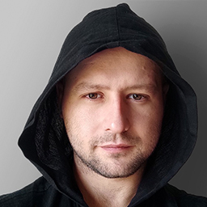

  


# Alexandr Turdiyev  


> Web Developer  

## ABOUT
- I strive to create high-quality web applications that exceed user expectations.   
- **My goal** is to ensure a positive interaction between humans and the digital world. I prioritize modern and intuitive interfaces, clean and maintainable code.  
- Attention to detail, smart technology choices and implementation strategies, a personalized approach to clients, and teamwork skills are my way of life.

## SKILLS
- **Programming. Markup and Styling:**
	- HTML5 
	- CSS3 / SASS/SCSS / Bootstrap
	- JavaScript
	- BEM Methodology

- **Build Tools:**
	- Webpack / Gulp

- **Content Management Systems (CMS)**
	- WordPress: Custom theme development

- **Version Control:**    
	- Git / GitHub

- **Web Application Deployment:**    
	- Selecting a server that meets application requirements
	- Acquiring and registering a domain
	- Working with popular hosting services

- **Design:**    
    - FIGMA / Adobe Photoshop / Adobe Illustrator
- **Development Environments:**    
    - Microsoft Visual Studio Code / JetBrains WebStorm

- **Database Management:**    
	- MySQL / PhpMyAdmin   

- **Languages:**    
  - Russian: native
  - English: B1 (reading proficiency)

## EDUCATION
### IT
- **Almaty Technical College** / Faculty of **Computing and Software** / Specialty: **Software Technician**.

### INDUSTRIAL AUTOMATION AND ELECTRICAL DRIVE CONTROL
- **SIEMENS:** Practical course on software development for SIMATIC S7-300, S7-400, S7-1200, S7-1500.
- **Schneider Electric:** Practical course on software development for Modicon M221.
- **VACON:** Practical course on working with VACON (Danfoss) 100 FLOW **Variable Frequency Drive**.

## WORK EXPERIENCE
### IT
- **Developed** a **custom theme** for **WordPress** for a **client**.
- **Developed** and **published** the **website** [farizmamedovinteriors.com](https://farizmamedovinteriors.com).

**Example code** for the background slider image transition on the main page of the website https://farizmamedovinteriors.com:
```
function switchImage() {
    images[currentIndex].classList.remove('bg-slider__img--active');
    currentIndex = (currentIndex + 1) % images.length; 
    images[currentIndex].classList.add('bg-slider__img--active'); 
}

setInterval(switchImage, delay); 
```
This code snippet demonstrates the functionality for changing background images in a slider on the homepage of the mentioned website. The switchImage function removes the active class from the current image, increments the index, and adds the active class to the next image. The function is called at regular intervals specified by the delay variable using setInterval.


### INDUSTRIAL AUTOMATION
- Worked as a Service Engineer and an **Automated Control Systems Engineer** in a company that supplies and services equipment at major enterprises for oil, **gold**, copper, uranium, and other mineral extraction in the Republic of Kazakhstan. Target sites include Západnaya Prorva Field, **KAZ Minerals Aktogay**, INKAI (**KAZATOMPROM**) and others.

## HOBBIES
- Sports
- Development of electronic devices based on STM32 microcontrollers
- Traveling

## CONTACT
 E-mail: [alexandr.turdiyev@gmail.com](mailto:alexandr.turdiyev@gmail.com)  
 WhatsApp: [+7 705 770 25 77](whatsapp://send?phone=77057702577&text=Привет)  
 Telegram: [@alexandr_turdiyev](https://t.me/alexandr_turdiyev)  
 Discord: [@alexandr_turdiyev](https://discordapp.com/users/955026775396741182/) / [Alex (@AlexandrTurdiyev)](https://discordapp.com/users/955026775396741182/) - RS SCHOOL Server username  
 Instagram: [alexandr.turdiyev](https://www.instagram.com/alexandr.turdiyev/)